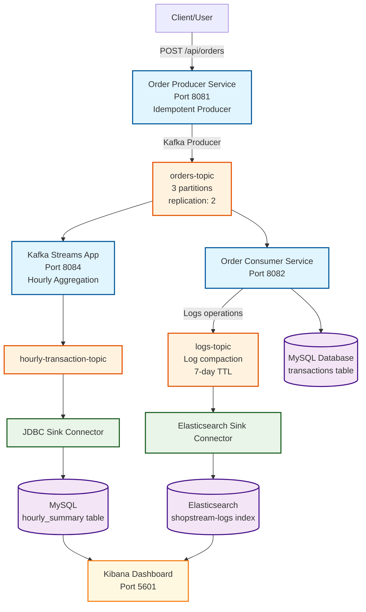
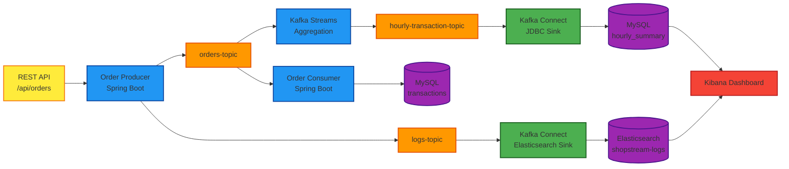
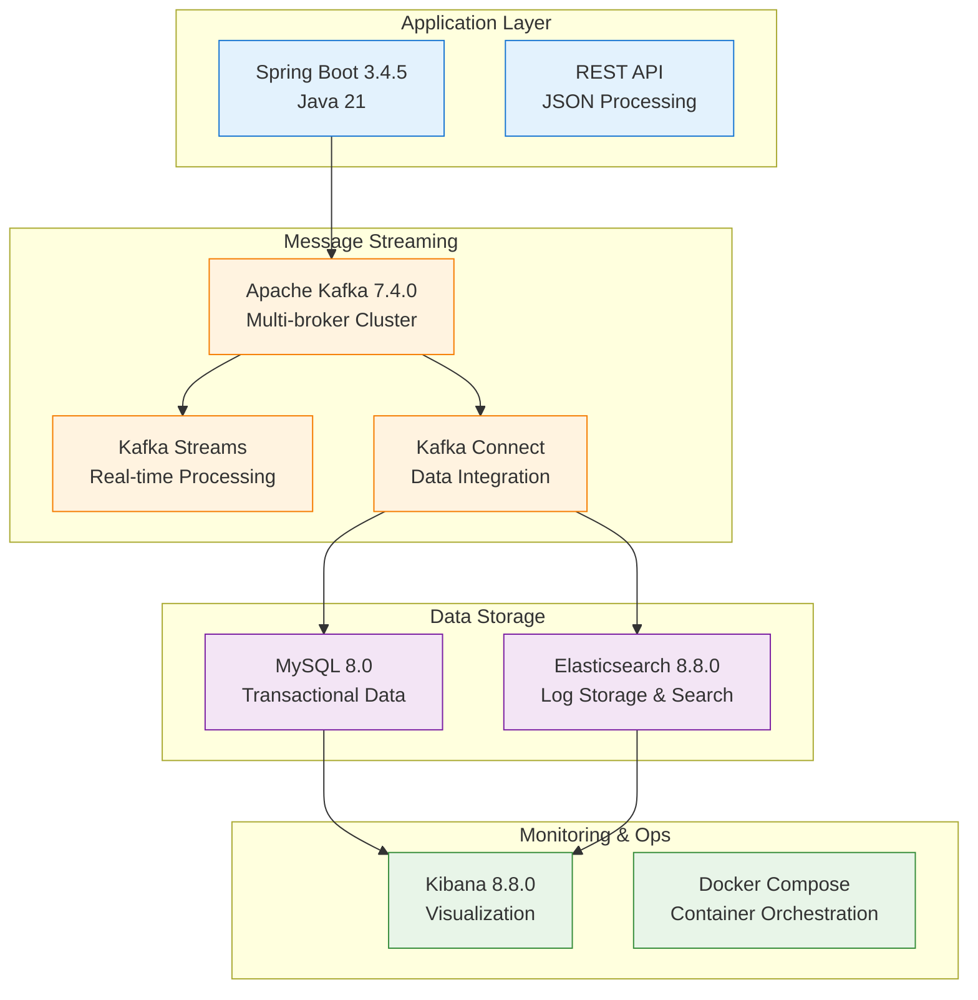
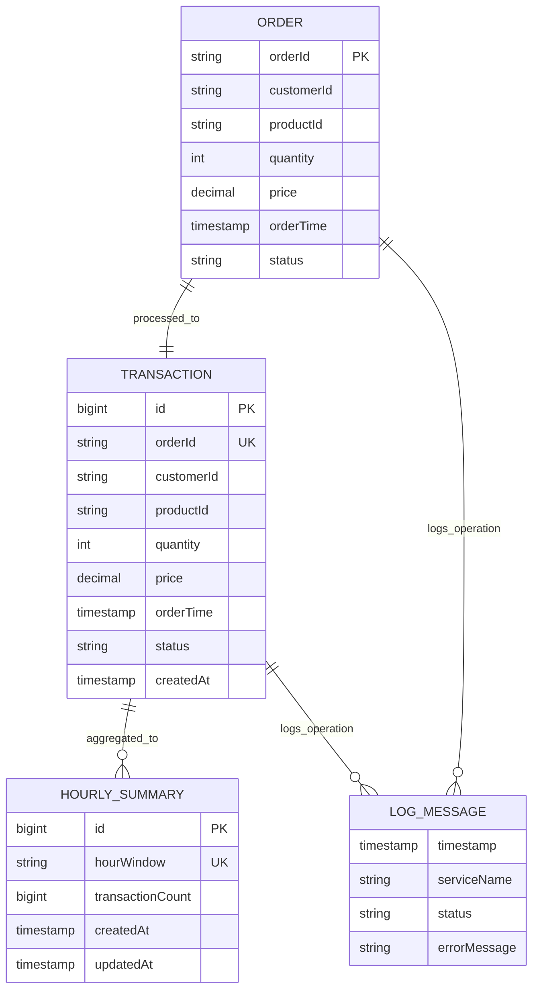

# Kafka-Based Microservices Architecture

## Data Flow Architecture

## Component Architecture

## Technology Stack

## Data Schema

## Key Features Implemented

- ✅ **Idempotent Producer**: Ensures exactly-once semantics
- ✅ **Topic Configuration**: Proper partitioning and replication
- ✅ **Stream Processing**: Real-time hourly aggregation
- ✅ **Data Integration**: Kafka Connect with JDBC and Elasticsearch sinks
- ✅ **Error Handling**: Comprehensive logging and monitoring
- ✅ **Scalability**: Multi-broker Kafka cluster setup
- ✅ **Containerization**: Docker Compose for easy deployment